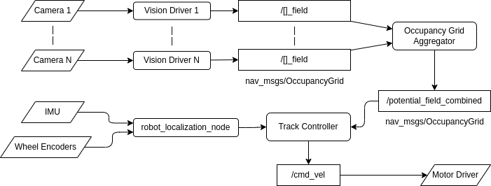

# Redshell ROS Workspace
This repo contains the ROS2 Humble workspace for the redshell droid.

## Architecture
<p align="center">  
    
</p>  


## Environment Setup
- Install [Docker](https://docs.docker.com/engine/install/)
- Clone the `redshell_ws` repository along with its submodules with,
```bash
git submodule update --init --recursive
```
- Build and run the docker container with,
```bash
docker compose -f docker/compose.yaml build redshell
docker compose -f docker/compose.yaml run redshell
```

## Run
The redshell launch files can be found in `src/redshell_bringup/launch/`. To bringup one of these configurations, enter
docker container and run,
```bash
colcon build && source install/setup.bash
ros2 launch redshell_bringup [launch file]
```